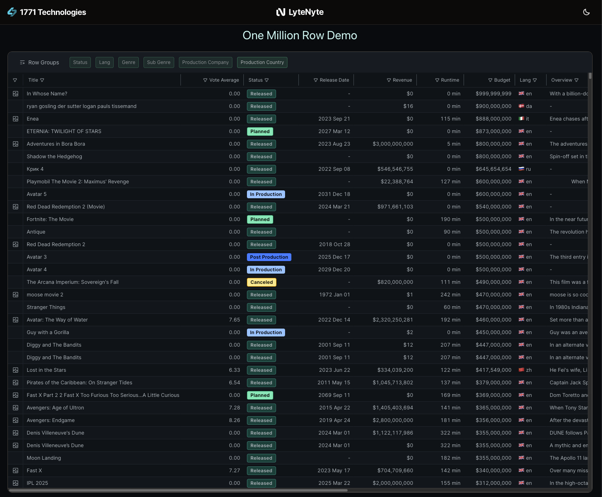

# One Million Row Demo (TypeScript)

A high-performance demo illustrating how to load and interact with over one million
rows of data from an external source using LyteNyte Grid. This example showcases a
TypeScript reference implementation that uses server data loading.

In addition to [LyteNyte Grid](https://www.1771technologies.com/demo), this demo uses:

- [SQLite](https://sqlite.org/)
- [Vite](https://vitejs.dev/)
- [Hono](https://hono.dev/)

## Overview

This guide explains the server data loading TypeScript reference implementation.
The reference implementation is self-contained, allowing you to get started quickly.

It uses SQLite as the backing database. While SQLite is suitable for examples and
embedded applications, we recommend an industrial-grade database such as 
[ClickHouse](https://clickhouse.com/).

Use this implementation to understand the form of SQL queries your
backend should run to support LyteNyte Grid features. This simple example serves
as a starting point and demonstrates only a limited set of features,
including filtering, sorting, grouping, and aggregations.

> [!Note]
> This TypeScript reference implementation is for demonstration purposes only. The reference
> implementation is single threaded for simplicity, hence requests to the server are queued
> and resolved sequentially.

## 🚀 Getting Started

Clone the repository and install dependencies:

```bash
git clone https://github.com/1771-Technologies/one-million-row-demo.git
cd one-million-row-demo
git lfs fetch --all
git lfs pull
pnpm install
pnpm run dev
```

This launches:

- A Vite frontend for the UI
- A Hono backend that serves data from `movies.db` to the frontend

## About The Data

The reference implementation uses a movie dataset with ~1.3 million rows. The dataset is available
on [Kaggle](https://www.kaggle.com/datasets/shubhamchandra235/imdb-and-tmdb-movie-metadata-big-dataset-1m) 
for testing. It includes columns such as title, release year, genre, and ratings.

The implementation does not utilize every column, and some values have been
adjusted to illustrate the example better. See `create-db.ts` for the code
used to generate `movies.db`.

> [!Note]
> The Million Row Demo uses [Git LFS](https://git-lfs.com/) to store the database
> file in the repository due to its large size. Install `git lfs`
> if you don’t already have it on your system.
>
> If that isn't an option, download the database from Kaggle and run `create-db.ts` to recreate it locally.

## TypeScript Implementation File

The key file, other than the UI, is `view-slice.ts`. This file builds and
executes the SQL query for each view. If you're not familiar with SQL,
`use view-slice.ts` as a reference when implementing your own server-side data source.

For detailed examples and logic, review the [file here](https://github.com/1771-Technologies/one-million-row-typescript/blob/main/server/view-slice.ts).

## Showcase Highlights

This demo showcases how [LyteNyte Grid](https://www.1771technologies.com/demo) blends high performance with seamless integration,
empowering developers to build data tables that effortlessly handle massive datasets.

Key features include:

- Virtualized rendering for smooth scrolling with millions of rows
- Fast filtering, sorting, and pagination
- Minimal setup with flexible configuration
- Designed for modern UI frameworks like React and Vite
